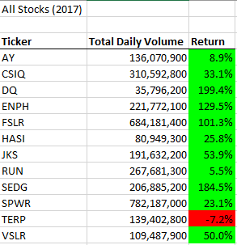
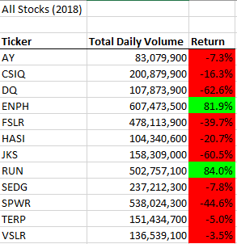
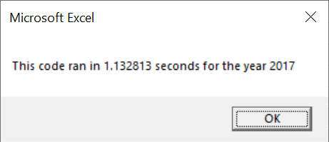
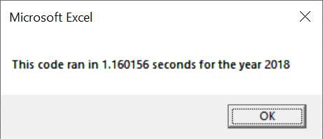
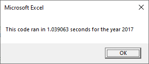
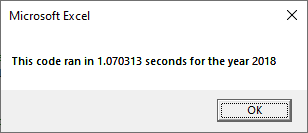

# Refactoring in VBA

## Project Overview and Purpose
A macro to analyze 2017 and 2018 stock data was originally created. Stock data includes, but not limited to, ticker ID, date, closing price, and volume. However, the macro may not be efficient enough when considering thousands of stocks. The original macro will need to be refactored in order to run more efficiently. The time it takes the refactored macro to run will determine whether the refactored macro is more efficient than the original macro. 

## Results

### Comparison of stock performance between 2017 and 2018

A table of ticker ID, Total Daily Volume, and Return were created for 2017 and 2018. Total Daily Volume represents the sum of all daily volumes of each ticker. Return represents the difference between the last day's closing price and the first day's closing price of each ticker. 

All stocks' return value in 2017, except for ticker ID TERP, performed better than in 2018. Ticker IDs DQ, ENPH, FSLR, and SEDG all had a return value of greater than 100% in 2017. 

All stock's return value in 2018 were negative, except for ticker ID ENPH and RUN. 

For Total Daily Volume, ticker IDs DQ, ENPH, HASI, RUN, SEDG, TERP, and VSLR had greater Total Daily volumes in 2018 than in 2017. 

Ticker ID ENPH seem to be the best stock in terms of return value when considering the consecutive years of 2017 and 2018. 

### Comparison execution times between original and refactored script

The time it took to run the refactored script for 2017 and 2018 was both faster than the 2017 and 2018's original script time. The refactored scripts ran approximately 0.09 seconds faster than the original script. 

The were two main differences that were made to the refactored script that made the execution times faster. 

In the original script, a variable "ticker" was used to represent the "tickers" array. A nested loop was used to loop through the tickers and then loop through the rows of data. In doing so, it determined the total daily volume and return value using if-then statements. 

In the refactored script, a variable "tickerIndex" was used to access the correct index across the four arrays created: tickers array, tickerVolumes array, tickerStartingPrices array, and tickerEndingPrices array. In doing so, you are mapping the same index to the same ticker and all other output arrays. For example: tickerVolumes(0), tickerStartingPrices(0), and tickerEndingPrices(0) would all be for tickers(0) which is the "AY" ticker. If-then statements were then used to determine the total daily volume and return value using if-then statements

The second main difference is reporting the output onto the worksheet. The refactored script relied on using the index to report the ticker ID, total daily volume, and return value for each index. Also, it was outside of the nested for loop. The original script was within the nested for loop and reported the ticker ID, total daily volume, and return value line-by-line.

## Summary

### Advantages and Disadvantages to Refactoring Code
The purpose of refactoring is to make the code more efficient. This could be taking fewer steps, using less memory, or improving the logic of the code. 

The main advantage to refactoring is producing a more efficient code. If time is important, then having a faster running script will be better than a script that is slower. In the real world, scripts like this could be used to analyze thousands of stocks. The time difference between the tqo scripts created would be much longer than 0.09 seconds.

A script that uses fewer steps could potentially be easier to read, uses less memory, and improves the logic. In the real world, scripts can potentially be shared among peers. Therefore, a script should be easily comprehensible so that others can understand as well.

The main disadvantage to refactoring is that it may be time-consuming. You may not know how long it will take to refactor the code. And if you do, it may not be as efficient as the first code.

### How the Pros and Cons apply to Refactoring the Original VBA Script
Refactoring the original script made the refactored script more efficient. It reduced the execution time to run the script. Since the difference was only approximately 0.09 seconds, it did not make much of a difference whether the code was refactored or not.

Depending on the person, the refactored code may or may not be easier to comprehend. Which is why it is always important to make comments on the code to describe what the specific line(s) of code is doing.

Refactoring the original script was time-consuming. The completion time of refactoring the original script was unknown, until the refactored script ran successfully. Fortunately, the modules assisted along the way to help the user be on the right track. 